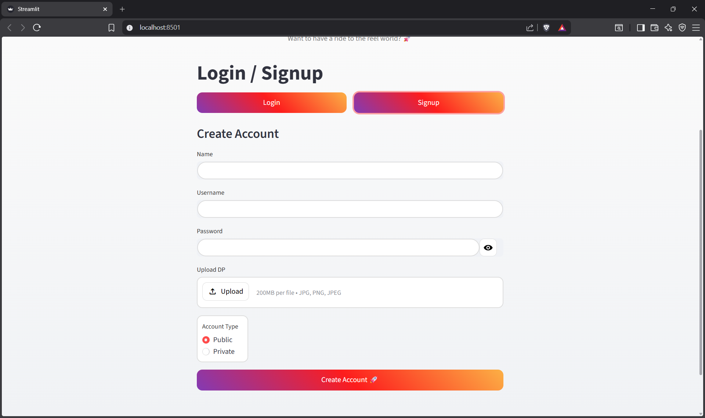
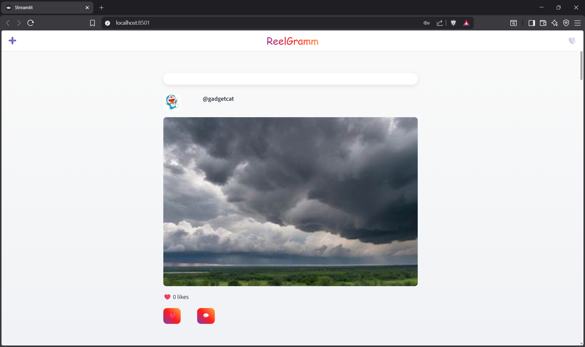
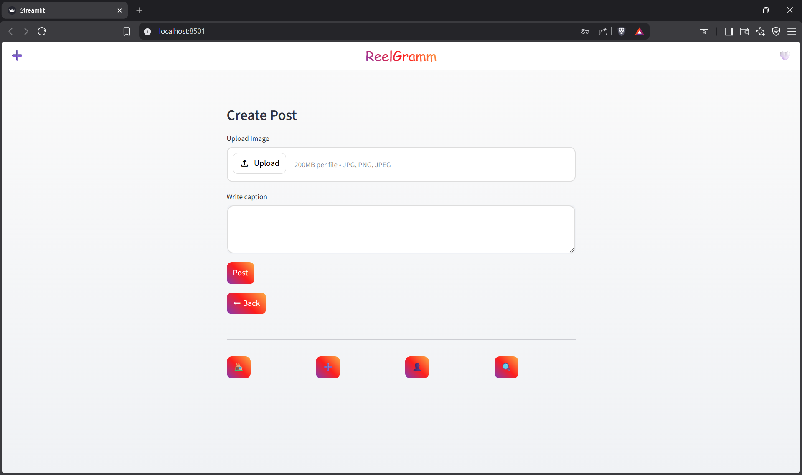
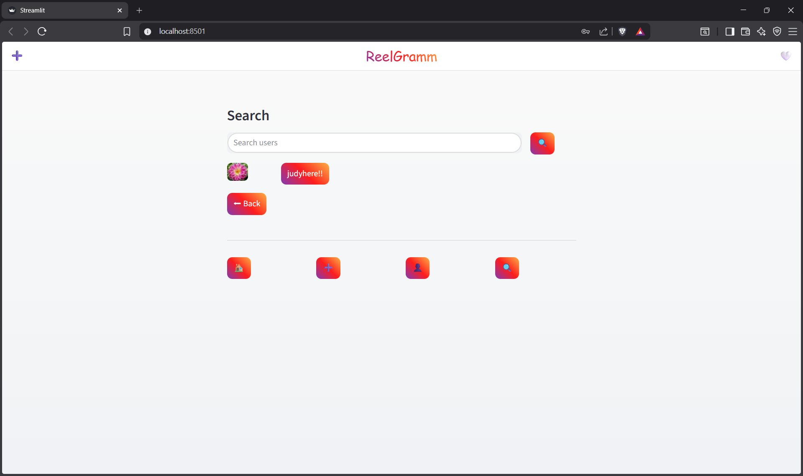
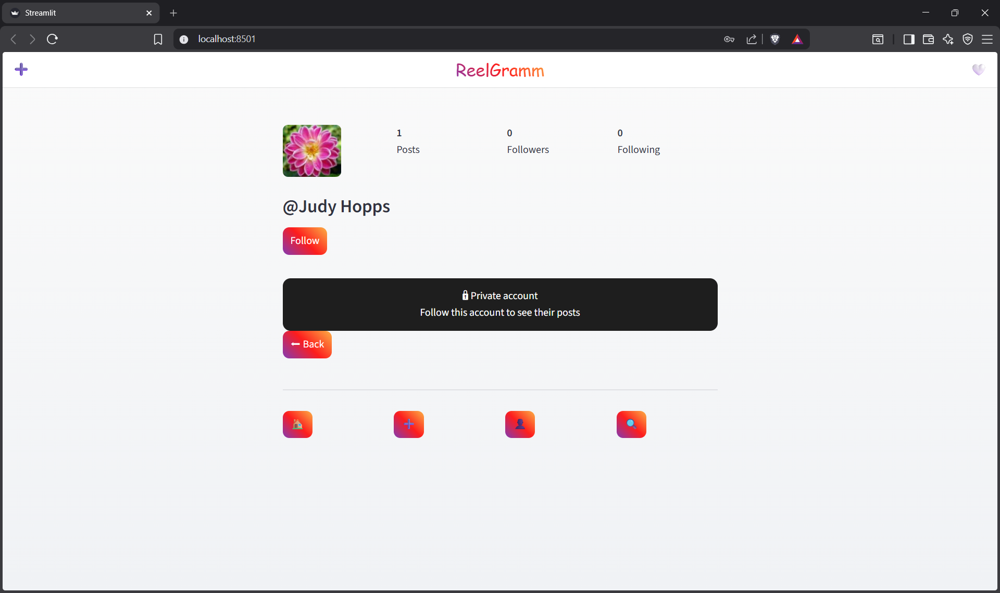

# 📸 ReelGramm

A simple Instagram-inspired social media web app built using **Streamlit**.
Users can sign up, log in, create posts, like, comment, and explore profiles.

---

## 🚀 Features

* 🔐 **Authentication**

  * Login & Signup system
  * Public & Private accounts
  * 

* 🏠 **Feed**

  * View posts from users
  * Like ❤️ and comment 💬 on posts
  * 

* 📸 **Post Creation**

  * Upload images
  * Add captions
  * 

* 👤 **Profile**

  * View your posts
  * Upload / delete profile picture
  * Followers & Following system

* 🔍 **Search**

  * Find users by username or name
  * 

* 🔒 **Privacy Control**

  * Private accounts restrict access to posts
  * 

---

## 🛠️ Tech Stack

* **Frontend & Backend:** Streamlit
* **Data Handling:** Pandas
* **Storage:** CSV files (local storage)
* **Language:** Python

---

## 📂 Project Structure

```
ReelGramm/
│
├── data/
│   ├── users.csv
│   └── posts.csv
│
├── images/
│   └── (uploaded images & profile pictures)
│
├── app.py
└── README.md
```

---

## ⚙️ Installation & Run

### 1. Clone the repository

```bash
git clone https://github.com/your-username/reelgramm.git
cd reelgramm
```

### 2. Install dependencies

```bash
pip install streamlit pandas
```

### 3. Run the app

```bash
streamlit run app.py
```
---

## 💡 Future Improvements

* ❤️ Double tap to like
* 📱 Mobile responsive design
* 🎥 Reels / video support
* 🔔 Notifications system
* ☁️ Database integration (Firebase / MongoDB)

---

## 🤝 Contributing

Contributions are welcome!
Feel free to fork this repo and improve it.

---

## 📄 License

This project is for educational purposes.

---

## ✨ Author

**Kashika Singh**

---

⭐ If you like this project, consider giving it a star!
